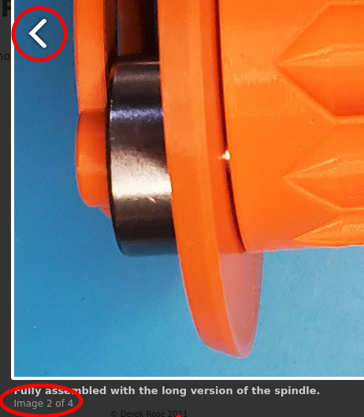

# Hugo Image Flow Shortcode with Lightbox

I was looking for a good way to condense image content on my blog posts, preferably something that could be a [hugo shortcode](https://gohugo.io/content-management/shortcodes/). Everything I was able to find was not quite right or far more complicated than I needed it to be. It's been a long time since I've done much frontend work but it didn't take long to learn enough CSS 3 to be able to customize [this flexbox example](https://css-tricks.com/adaptive-photo-layout-with-flexbox/) to my liking.

## Image Squash




### Features

* Adaptive
* Mixed resolution/orientation support
* Lightbox
* Captions
* Optional gallery slideshow (inside the lightbox)
* Lazy Loading
* Light Weight

### SCSS

The shortcode expects to be able to load its scss file from `assets/scss/image-squash.scss`. It will only load the CSS once per page, so you can have multiple image squashes per page without having the CSS loaded over and over.

The `<li>` height property is the most important. If you want your images to be bigger or smaller overall, try altering that value.

### Shortcodes

```HTML







```

#### image-squash-element options

* **image** *[required]* - The path to an individual image in the static directory.
* **gallery** *[optional]* - Photos with matching gallery values will be treated as a set. When open in a lightbox there will be Next/Previous buttons as well as an *Image X of Y* indication.
* **caption** *[optional]* - This will be used as image alt tags and will be displayed below the image in the lightbox.

### Prerequisite

[Lightbox2](https://lokeshdhakar.com/projects/lightbox2/)